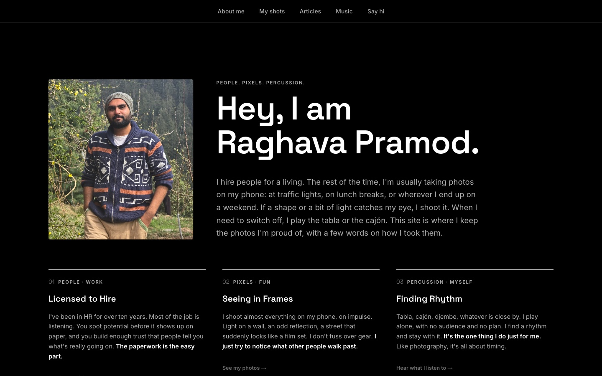
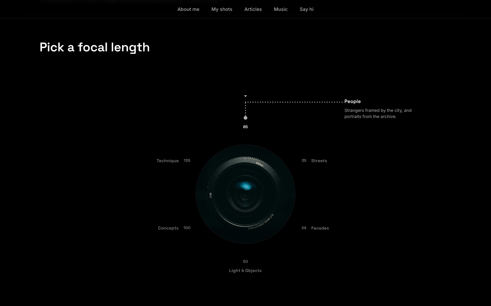
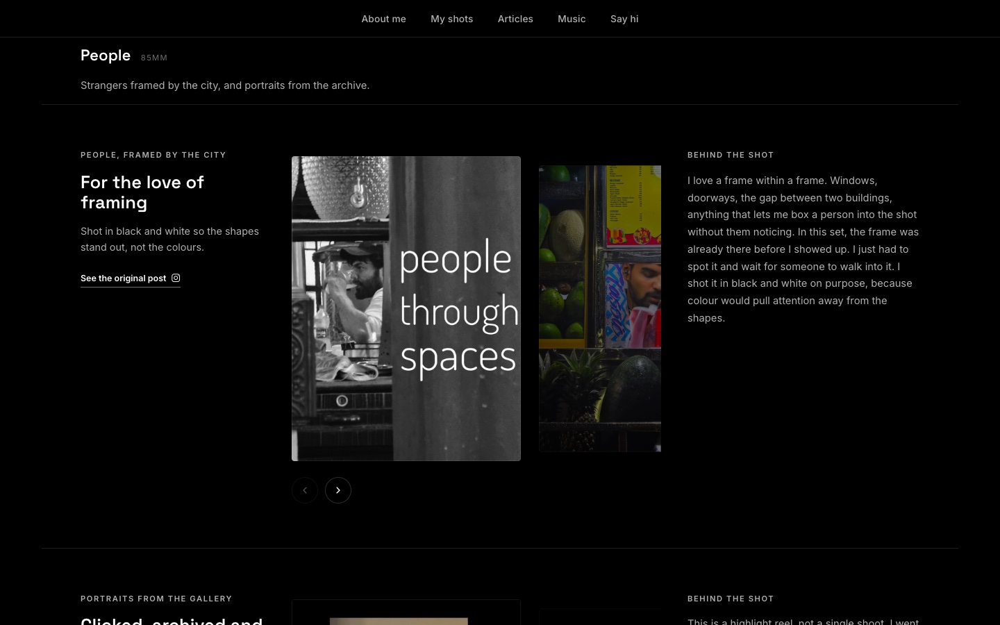
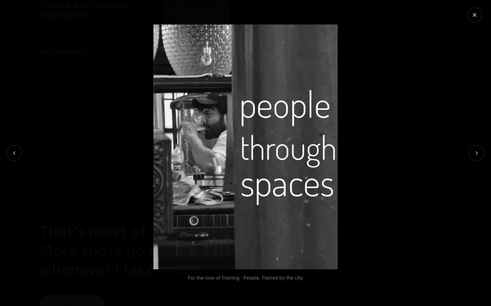
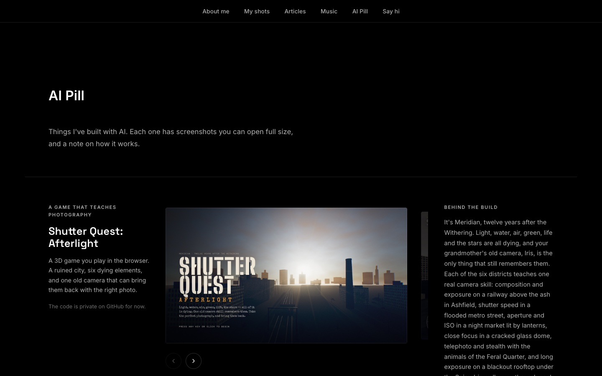
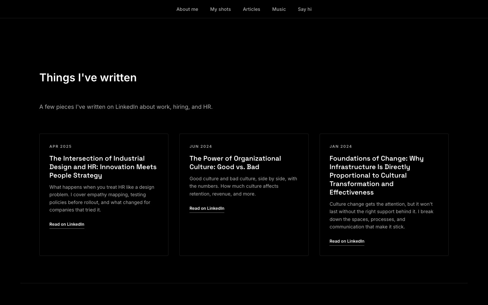
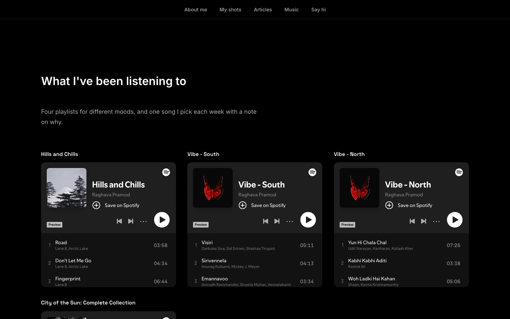
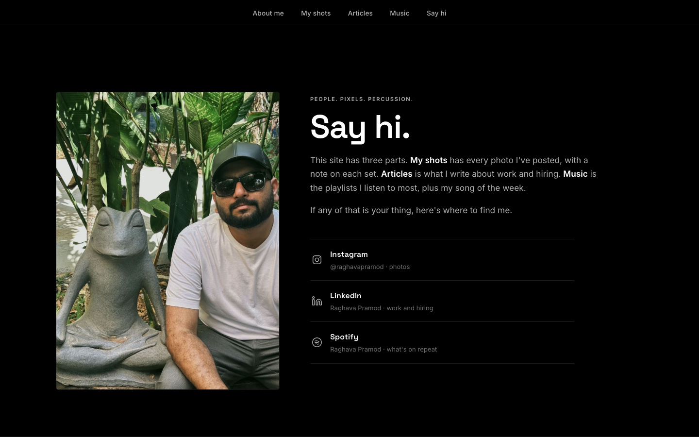
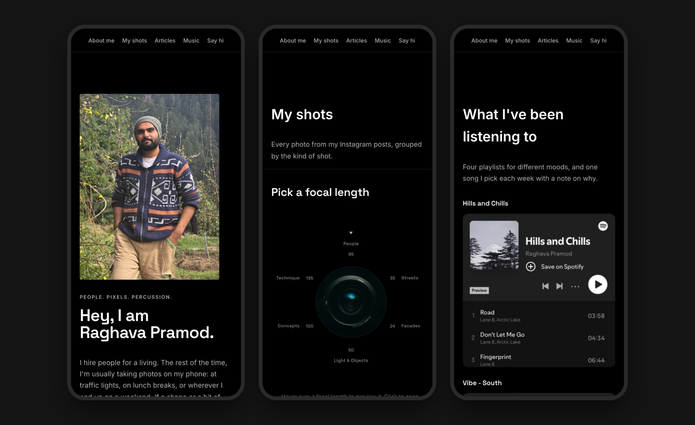

# Raghava Pramod

My personal site, live at **[raghavapramod.com](https://raghavapramod.com)**. It has the photos I've taken (mostly on my phone), a few articles on work and hiring, the music I've been listening to, and the things I've built with AI.



## My shots

Photos are grouped by the kind of shot. Hover a focal length on the lens to preview it, and click to open it.



| A series, with the story behind it | Full-size viewer |
|---|---|
|  |  |

## AI Pill

Things I've built with AI: Shutter Quest: Afterlight, the HR Operations Dashboard and this site. Each project uses the same card as My shots, with screenshots you can open full size and a note on how it works.



## Articles, Music, Say hi

| Articles | Music | Say hi |
|---|---|---|
|  |  |  |

## On a phone



## How it's built

Plain HTML, CSS and JavaScript, with no framework and no build step.

| File | What it is |
|------|------------|
| `index.html` | Home (About me) |
| `shots.html` | My shots, with the lens picker and photo viewer |
| `articles.html` | Articles |
| `music.html` | Music (Spotify playlists) |
| `ai-pill.html` | AI Pill, the projects I've built with AI |
| `contact.html` | Say hi |
| `script.js` | Photo series and project data, and all page behaviour |
| `styles.css` | Styles for every page |
| `images/` | The photos |
| `netlify.toml` | Netlify settings: short page links and image caching |
| `deploy.sh` | Publishes the site |

## Updating the site

Double-click **Update Website** on the Desktop, or run:

```bash
./deploy.sh "what changed"
```

It saves the changes and pushes them to this repo. Netlify publishes every push to `main`, and the script waits until the site is live.

## Preview locally

```bash
python3 -m http.server 8000
```

Then open http://localhost:8000.

This README and the `screenshots/` folder stay on GitHub only and are never published to the site.
